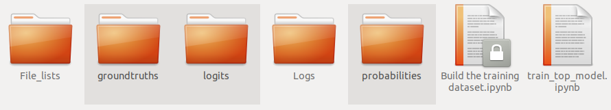
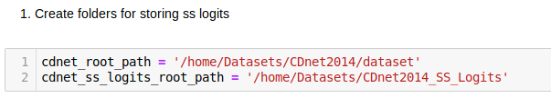
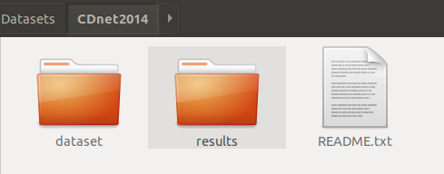
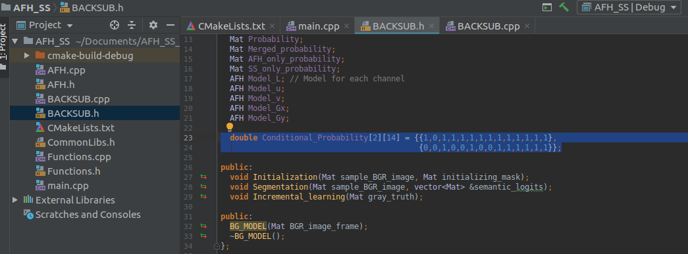
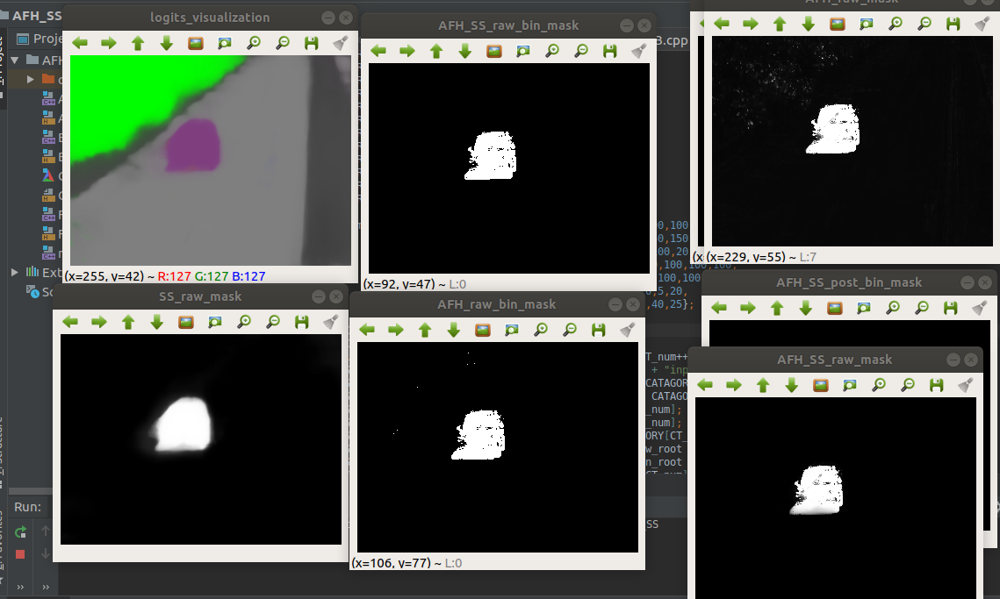
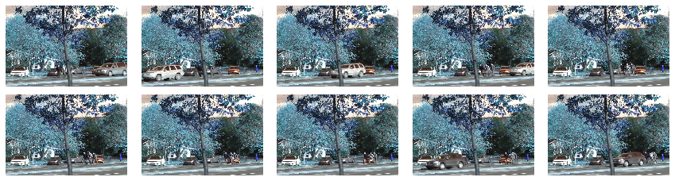

# Probability-based Framework to Fuse Temporal Consistency and Semantic Information for Background Segmentation

The following code is used to reproduce the experimental results in the article. 

## Part1: Reproducing the results

Reproducing the results in the paper consists of the following steps: (Note that you may install the jupyter notebook and tensorflow 1.12 to run the semantic model-related calculations. To evaluate the top model, we suggest to use the Clion IDE under the Linux environment. Also, one has to install opencv 3.x or 4.x in advance.)

## 1. [Training the Top model](./train_top_model)

### 1.1. Prepare the training set

The training set consists of 3 parts: the one contains the [logits from the temporal model](./train_top_model/probabilities), the one contains the [logits from the semantic model](./train_top_model/logits) and the one contains the [groundtruths](./train_top_model/groundtruths). These datasets are prepared already in the folder [train_top_model](./train_top_model).



If one want to use [models](https://github.com/andrewssobral/bgslibrary) that only produce binary segmentations or one cannot get the source code but have their [binary results](http://jacarini.dinf.usherbrooke.ca/results2014) at hand, use the inversed binary segmentations as the estimation of the conditional background probability. In other word, you should replace images in [train_top_model/probabilities](./train_top_model/probabilities) by the inverse of corresponding binary results. However, if one want to use the histogram based model and reproduce our result, just go ahead.

### 1.2. Training the model

Run the [notebook](./train_top_model/train_top_model.ipynb) to train the top model. During the training process, you can see how the parameters are changed. The trained model as well as the summaries are saved at [train_top_model/Logs](./train_top_model/Logs). Use tensorboard to check these summaries.


## 2. Create semantic logits for the CDnet dataset

Up to now, we cannot find a way to combine the DeepLab model with C++ based temporal models in a concise way. Thus, we should calculate logits from the semantic model in advance. As the whole logits for [CDnet](http://changedetection.net/) is approximately 30Gb+, we only upload the trained semantic model as frozened graph. Detailed processes are given to show how to use the model and to create all logits of the CDnet dataset.

### 2.1. A demo for the fine-tuned DeepLab V3+ on the CDnet

The folder [deeplab_demo_cdnet](./deeplab_demo_cdnet) contains a demo about how to use our [fine-tuned version](./Models/frozen_inference_graph.pd) of the [DeepLab V3+](https://github.com/tensorflow/models/tree/master/research/deeplab) model on [CDnet2014](http://changedetection.net/). Refer to the jupyter notebook [DeepLab_Demo_cdnet_model](./deeplab_demo_cdnet/DeepLab_Demo_cdnet_model.ipynb) for details.

If you successfully run the demo, you get the following result on a demo image.


Logits of the semantic segmentation are saved at [this folder](./deeplab_demo_cdnet/Logits).


*Since the fine-tuning process consists of countless trivil modifications of the original code and would cause bugs on other machines, we do not publish our training code in the current stage.*

### 2.2. Calculate all logits for the CDnet dataset

Run the notebook at [calculate_ss_logits_for_cdnet](./calculate_ss_logits_for_cdnet/calculate_ss_logits_for_cdnet.ipynb) to get all logits. Remember to change the paths for the cdnet datset and that for the logits.



## 3. Evaluate the top model

Only a few parameters are required to learn in the top model, and once learned, they can be applied to a wide range of environments. Note that the top model is build upon two other models: 1. the temporal-consistent based one; 2. the semantic model. One can replace each by arbitrary algorithm. For reproducing our results, we suggest to use the [fine-tuned DeepLab V3+](./Models/frozen_inference_graph.pd) as the semantic model. For temporal models, we provide both ways to use the modified [AFH model](https://ieeexplore.ieee.org/document/7468482) or the  the [SWCD method](https://www.spiedigitallibrary.org/journals/Journal-of-Electronic-Imaging/volume-27/issue-2/023002/SWCD--a-sliding-window-and-self-regulated-learning-based/10.1117/1.JEI.27.2.023002.short?SSO=1).

As told in Section 2, since the logits are calculated in advance, we are only required to load these logits as gray images when running either program. The learned parameters of the top model are constants in the code.

Before running our code, one has to download the entire [CDnet2014 datset](http://jacarini.dinf.usherbrooke.ca/dataset2014) and extract them somewhere.

### 3.1. Evaluate AFH, SS, and AFH+SSA (Reproducing the results in Figure5, Figure6)

To evaluate the AFH model only, semantic model only, and the top model built upon the [AFH model](https://ieeexplore.ieee.org/document/7468482) and the [fine-tuned DeepLab V3+](./Models/frozen_inference_graph.pd), MAKE SURE the following preparations are done:

1). The entire [CDnet2014 datset](http://jacarini.dinf.usherbrooke.ca/dataset2014) are downloaded and extracted;

2). All semantic logits are calculated for the CDnet2014 dataset (see section 2.2);

3). One gets all the trained parameters of the top model. (Since we have already recorded these parameters, you do not need to train the top model again.)

4). (optional) Setup folders to record all kinds of intermediate results. To do this, just copy, replicate, and rename the empty results folder under the root path of the downloaded CDnet2014 dataset.




5). Open the [C++ project](./evaluate_AFH_SS/AFH_SS) and modifiy the paths in main.cpp according to your own settings. The first two paths must be set correctly!


6). (no need to change) Write the learned parameters in step 1.2 in BACKSUB.h. Since we have trained the top mode and set the parameters in advance, there is no need to change them. The first column are for other use and PLEASE DO NOT CHANGE THEM! If one want to use other parameters, just copy the trained parameters to the SECOND~LAST COLUMNS!



7). Set the path for opencv in CMakeLists.txt.


Run the project and you will see all intermediate results. These results are also recorded in the corresponding folders.



We also provide a program to calculate the scores in a [jupyter notebook](./evaluate_AFH_SS/scores.ipynb). All score records are also given there.

### 3.2. Evaluate SWCD+SSA (Reproducing the results in Table I, Table II, Figure7)

This is our best scored model, which built upon the [SWCD method](https://www.spiedigitallibrary.org/journals/Journal-of-Electronic-Imaging/volume-27/issue-2/023002/SWCD--a-sliding-window-and-self-regulated-learning-based/10.1117/1.JEI.27.2.023002.short?SSO=1) and the [fine-tuned DeepLab V3+](./Models/frozen_inference_graph.pd). Before running our code, MAKE SURE the following preparations are done:

1). The entire [CDnet2014 datset](http://jacarini.dinf.usherbrooke.ca/dataset2014) are downloaded and extracted;

2). All semantic logits are calculated for the CDnet2014 dataset (see section 2.2);

3). Download the [results](http://jacarini.dinf.usherbrooke.ca/m/SWCD_526.zip) of SWCD from CDnet website and extract them;

4). One gets all the trained parameters of the top model. (Since we have already recorded these parameters, you do not need to train the top model again.)

5). (optional) Setup folders to record all kinds of intermediate results. To do this, just copy, replicate, and rename the empty results folder under the root path of the downloaded CDnet2014 dataset.


6). Open the [C++ project](./evaluate_SWCD_SS/SWCD_SS) and modifiy the paths in main.cpp according to your own settings. The first two paths must be set correctly!


7). (no need to change) Write the learned parameters in step 1.2 in BACKSUB.h. Since we have trained the top mode and set the parameters in advance, there is no need to change them. The first column are for other use and PLEASE DO NOT CHANGE THEM! If one want to use other parameters, just copy the trained parameters to the SECOND~LAST COLUMNS!


8). Set the path for opencv in CMakeLists.txt.


Run the project and you will see binary results. These results are also recorded in the corresponding folders. We also provide a program to calculate the scores in a [jupyter notebook](./evaluate_SWCD_SS/scores.ipynb). All score records as well as per category scores are also given there.


## Part2: Demo for Deep Neural Network

This demo illustrate how to build the neural network in Figure3 and how to use the neural network for inference. We train the three parts seperately for the reason of  efficiency. Neverthless, one can always train the whole model end-to-end using much more resources. A few details will be added after the publishment of the research.

## 4. Unified Model Inference


```python
import matplotlib.pyplot as plt
import numpy as np
import os
import glob
import random
import cv2

import tensorflow as tf
import tensorflow.keras as keras
import tensorflow.keras.backend as K

from tensorflow.keras.optimizers import Adam, SGD, RMSprop, Nadam, Adagrad, Adadelta
from tensorflow.keras.callbacks import TensorBoard,ModelCheckpoint,ReduceLROnPlateau,EarlyStopping,LambdaCallback
from tensorflow.keras.layers import *
from tensorflow.keras.models import Model, Sequential
from tensorflow.keras.utils import plot_model,Sequence

from utilities import plot_tensor
from deeplabv3pMS import Deeplabv3
import math
```


```python
from joblib import Parallel, delayed
```

### 4.1. Initialization


```python
video_name_str = "./Demo_Video/"
results_path = './Demo_Results/'
```


```python
seq_len = 10
seq_delta = 20
batch_size = 5
```

### 4.2. Load data


```python
images_dataset_path_list = sorted(glob.glob(video_name_str+'*.jpg'))
```


```python
Height,Width = cv2.imread(images_dataset_path_list[0],0).shape
Height_Ext = math.ceil(Height/16)*16
Width_Ext = math.ceil(Width/16)*16
print(Height,Width,Height_Ext,Width_Ext)
```

    480 720 480 720
    


```python
input_dataset = np.zeros([len(images_dataset_path_list),Height_Ext,Width_Ext,3],dtype = np.float32)
def read_input_images(i):
    input_dataset[i,:Height,:Width,:] = cv2.imread(images_dataset_path_list[i])
Parallel(n_jobs=-1, verbose=2, prefer="threads")(delayed(read_input_images)(i) for i in range(len(images_dataset_path_list)));
```

    [Parallel(n_jobs=-1)]: Using backend ThreadingBackend with 20 concurrent workers.
    [Parallel(n_jobs=-1)]: Done   1 tasks      | elapsed:    0.0s
    [Parallel(n_jobs=-1)]: Done 122 tasks      | elapsed:    0.0s
    [Parallel(n_jobs=-1)]: Done 325 tasks      | elapsed:    0.1s
    [Parallel(n_jobs=-1)]: Done 600 out of 600 | elapsed:    0.3s finished
    

### 4.3. Create Generator


```python
def extract_clip_indices(begin,end,head,clip_len,delta):
    position = head - begin;
    sequence = np.arange(begin,end+1,1)
    if head < clip_len*delta:
        clip_indices = np.flip([sequence[position+i*delta] for i in range(clip_len)])
    else:
        clip_indices = np.flip([sequence[position-i*delta] for i in range(clip_len)])
    return clip_indices 
    
def extract_clip_indices_list(begin,end,head_list,clip_len,delta):
    clip_indices_list = []
    for head in head_list:
        clip_indices_list.append(extract_clip_indices(begin,end,head,clip_len,delta))
    return clip_indices_list    
```


```python
class unified_test_X_generator(Sequence):
    def __init__(self,input_dataset,seq_len,seq_delta,batch_size):
        # Pre settings
        self.data = input_dataset
        self.seq_len = seq_len
        self.seq_delta = seq_delta
        self.batch_size = batch_size
        self.clip_frames_list = extract_clip_indices_list(0,
                                                          self.data.shape[0],
                                                          np.arange(self.data.shape[0]),
                                                          self.seq_len,self.seq_delta)
        #print(self.clip_frames_list)
        
    def __len__(self):
        'Denotes the number of batches per epoch'
        return int(np.ceil(self.data.shape[0] / self.batch_size))
    
    def __getitem__(self, i):
        
        batch_X = []

        for j in range(i*self.batch_size,min(self.data.shape[0],(i+1)*self.batch_size)):
            batch_X.append(self.data[self.clip_frames_list[j],:,:,:])

        batch_X = np.asarray(batch_X)
        
        return [batch_X[:,:,:,:,:]/255,batch_X[:,-1,:,:,:]]
    
    def on_epoch_end(self):
        'Updates indexes after each epoch'
        pass
```


```python
X_generator = unified_test_X_generator(input_dataset,seq_len=seq_len,seq_delta=seq_delta,batch_size=batch_size)
```


```python
print(X_generator.__getitem__(0)[0].shape)
plot_tensor(X_generator.__getitem__(20)[0][0,:,:,:])
```

    (5, 10, 480, 720, 3)
    





### 4.4. Load Semantic model


```python
# The first and last classes are irrelevant ones. Only the middle 13 classes are meaningful.
deeplabv3p = Deeplabv3(input_tensor=None,input_shape=(None,None,3),classes=15) 
```


```python
kernel_tensor = tf.zeros((3,3,1))
```


```python
inputs = keras.layers.Input(shape=(None,None,3))
upscaled_inputs = keras.layers.UpSampling2D(interpolation='bilinear')(inputs)
out_up = deeplabv3p(upscaled_inputs)
out_raw = deeplabv3p(inputs)
out_up_back = keras.layers.MaxPooling2D()(out_up)
out_up_back_epd = Lambda(lambda x: tf.expand_dims(x,axis=1))(out_up_back)
out_epd = Lambda(lambda x: tf.expand_dims(x,axis=1))(out_raw)
out_concatinate = keras.layers.Concatenate(axis=1)([out_up_back_epd,out_epd])
ms_hidden = Conv3D(filters=1, kernel_size=(5, 5, 1),
                    padding='same',data_format='channels_first',
                    activation='linear')(out_concatinate)

ms_hidden = keras.layers.LeakyReLU(alpha=0.01)(ms_hidden)

ms_hidden = Lambda(lambda x: tf.squeeze(x,axis=1))(ms_hidden)

ms_out = Activation('softmax')(ms_hidden)

ms_out_person = Lambda(lambda x: tf.nn.erosion2d(x, filters=kernel_tensor, strides=(1,1,1,1),
                                                 padding='SAME',data_format='NHWC',dilations=(1,1,1,1)))(ms_out[:,:,:,1:2])

ms_out1 = tf.concat([ms_out[:,:,:,0:1],ms_out_person],axis=-1)
ms_out2 = tf.concat([ms_out1,ms_out[:,:,:,2:15]],axis=-1)

MS_model = Model(inputs,ms_out2,name='MS_model')
```


```python
MS_model.load_weights('./Semantic_model_weights/Smaller_MS_model_final.h5')
```


```python
for layer in MS_model.layers:
    layer.trainable = False
```

### 4.5. Load Temporal Model


```python
temporal_model = Sequential()
temporal_model.add(ConvLSTM2D(filters=40, kernel_size=(3, 3),strides=2,
                   input_shape=(seq_len, None, None, 3),
                   padding='same', return_sequences=True))
temporal_model.add(BatchNormalization())

temporal_model.add(ConvLSTM2D(filters=40, kernel_size=(3, 3),strides=2,
                   padding='same', return_sequences=False))
temporal_model.add(BatchNormalization())

temporal_model.add(UpSampling2D())
temporal_model.add(Conv2D(filters=10, kernel_size=(3, 3),
               activation='relu',
               padding='same', data_format='channels_last'))
temporal_model.add(UpSampling2D())
temporal_model.add(Conv2D(filters=1, kernel_size=(3, 3),
               activation='sigmoid',
               padding='same', data_format='channels_last'))
```


```python
temporal_model.load_weights('./Temporal_model_weights/3_temporal_model_fall.h5')
```


```python
for layer in temporal_model.layers:
    layer.trainable = False 
```

### 4.6. Load Top Model


```python
probability_stack = keras.layers.Concatenate(axis=-1)([temporal_model.output for i in range(15)])
inverse_probability_stack = Lambda(lambda x: 1.0-x)(probability_stack)
joint_probabilitys_0 = Lambda(lambda x: (x[0]*x[1])[0])([probability_stack,MS_model.outputs])
joint_probabilitys_1 = Lambda(lambda x: (x[0]*x[1])[0])([inverse_probability_stack,MS_model.outputs])
class MinMaxConstraint(tf.keras.constraints.Constraint):
    def __init__(self, min_value=0.0, max_value=1.0):
        self.min = min_value
        self.max = max_value

    def clip(self, w):
        m = tf.keras.backend.clip(w,self.min,self.max)

    def __call__(self, w):
        return tf.keras.backend.clip(w,0.0,1.0)
part_0 = keras.layers.Dense(1, use_bias=False, kernel_constraint=MinMaxConstraint())(joint_probabilitys_0)
part_1 = keras.layers.Dense(1, use_bias=False, kernel_constraint=MinMaxConstraint())(joint_probabilitys_1)   
total_prob = Lambda(lambda x: x[0]+x[1])([part_0,part_1])
unified_model = Model(inputs=[temporal_model.input,MS_model.input], outputs=total_prob)
```


```python
# Coeeficients for the first and last classes are irrelevant ones. Only the middle 13 classes are meaningful.
part_0_weights = [np.array([[0.],[1.],[0.],[1.],[1.],[0.],[1.],[1.],[0.],[0.],[0.],[0.],[0.],[0.],[0.]])]
part_1_weights = [np.array([[0.],[1.],[0.],[0.],[0.],[0.],[0.],[0.],[0.],[0.],[0.],[0.],[0.],[0.],[0.]])]
```


```python
unified_model.layers[-3].set_weights(part_0_weights)
unified_model.layers[-2].set_weights(part_1_weights)
```

### 4.7. Predict and Save


```python
y_pred_raw = unified_model.predict(X_generator,max_queue_size = 10, workers = 8, verbose=1)
y_pred = np.where(y_pred_raw>0.5, 1.0, 0.0)[:,0:Height,0:Width,:]
```

    120/120 [==============================] - 186s 2s/step
    


```python
for k in range(len(y_pred)):
    y_pred_temp = np.concatenate((y_pred[k]*255, y_pred[k]*255, y_pred[k]*255), axis=-1)
    cv2.imwrite(results_path+str(k+1).zfill(6)+".png",y_pred_temp)
```

### 4.8. Illustrations


```python
check_index = 20
plot_tensor(X_generator.__getitem__(check_index)[0][:,-1,:,:,:])
plot_tensor(y_pred_raw[check_index*batch_size:(check_index+1)*batch_size])
```


