# A universal framework for fusing temporal consistency and semantic information for background segmentation

*-by Zhi Zeng, Liuyin Wang, Fulei Ma, Zheng Li, and Mengqi Xie*

This folder contains all details for reproducing our experimental results in our paper. More details regarding our work will be added when the paper is accepted.

Reproducing the result of our project consists of the following steps: (Note that you may install the jupyter notebook and tensorflow 1.12 to run the semantic model-related calculations. To evaluate the top model, we suggest to use the Clion IDE under the Linux environment. Also, one has to install opencv 3.x or 4.x in advance.)

## 1. [Training the Top model](./train_top_model)

### 1.1. Prepare the training set

The training set consists of 3 parts: the one contains the [logits from the temporal model](./train_top_model/probabilities), the one contains the [logits from the semantic model](./train_top_model/logits) and the one contains the [groundtruths](./train_top_model/groundtruths). These datasets are prepared already in the folder [train_top_model](./train_top_model).

If one want to use [models](https://github.com/andrewssobral/bgslibrary) that only produce binary segmentations or one cannot get the source code but have their [binary results](http://jacarini.dinf.usherbrooke.ca/results2014) at hand, use the inversed binary segmentations as the estimation of the conditional background probability. In other word, you should replace images in [train_top_model/probabilities](./train_top_model/probabilities) by the inverse of corresponding binary results. However, if one want to use the histogram based model and reproduce our result, just go ahead.

### 1.2. Training the model

Run the [notebook](./train_top_model/train_top_model.ipynb) to train the top model. During the training process, you can see how the parameters are changed. The trained model as well as the summaries are saved at [train_top_model/Logs](./train_top_model/Logs). Use tensorboard to check these summaries.

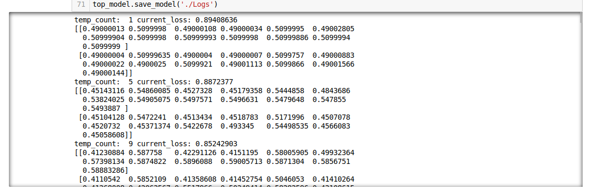

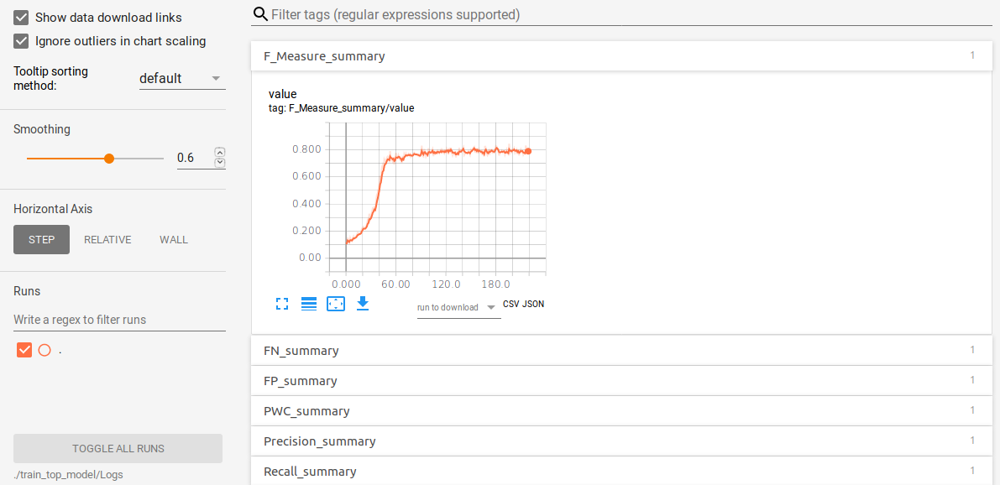

## 2. Create semantic logits for the CDnet dataset

Up to now, we cannot find a way to combine the DeepLab model with C++ based temporal models in a concise way. Thus, we should calculate logits from the semantic model in advance. As the whole logits for [CDnet](http://changedetection.net/) is approximately 30Gb+, we only upload the trained semantic model as frozened graph. Detailed processes are given to show how to use the model and to create all logits of the CDnet dataset.

### 2.1. A demo for the fine-tuned DeepLab V3+ on the CDnet

The folder [deeplab_demo_cdnet](./deeplab_demo_cdnet) contains a demo about how to use our [fine-tuned version](./Models/frozen_inference_graph.pd) of the [DeepLab V3+](https://github.com/tensorflow/models/tree/master/research/deeplab) model on [CDnet2014](http://changedetection.net/). Refer to the jupyter notebook [DeepLab_Demo_cdnet_model](./deeplab_demo_cdnet/DeepLab_Demo_cdnet_model.ipynb) for details.

If you successfully run the demo, you get the following result on a demo image.
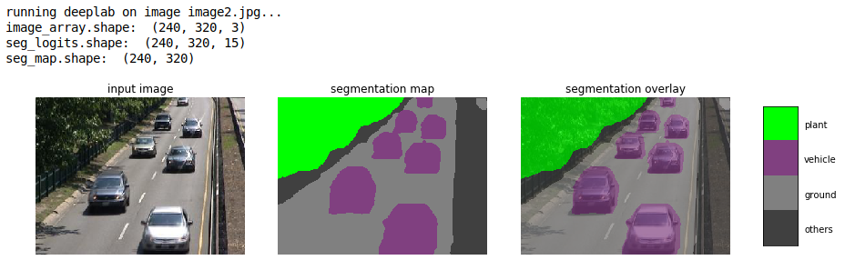

Logits of the semantic segmentation are saved at [this folder](./deeplab_demo_cdnet/Logits).
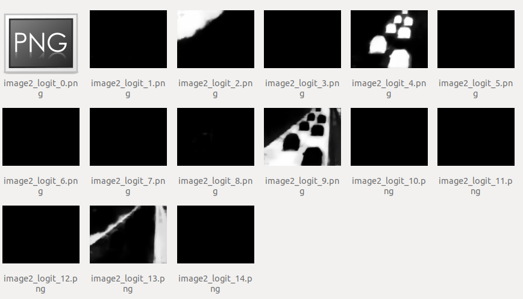

*Since the fine-tuning process consists of countless trivil modifications of the original code and would cause bugs on other machines, we do not publish our training code in the current stage.*

### 2.2. Calculate all logits for the CDnet dataset

Run the notebook at [calculate_ss_logits_for_cdnet](./calculate_ss_logits_for_cdnet/calculate_ss_logits_for_cdnet.ipynb) to get all logits. Remember to change the paths for the cdnet datset and that for the logits.

## 3. Evaluate the top model

Only a few parameters are required to learn in the top model, and once learned, they can be applied to a wide range of environments. Note that the top model is build upon two other models: 1. the temporal-consistent based one; 2. the semantic model. One can replace each by arbitrary algorithm. For reproducing our results, we suggest to use the [fine-tuned DeepLab V3+](./Models/frozen_inference_graph.pd) as the semantic model. For temporal models, we provide both ways to use the modified [AFH model](https://ieeexplore.ieee.org/document/7468482) or the  the [SWCD method](https://www.spiedigitallibrary.org/journals/Journal-of-Electronic-Imaging/volume-27/issue-2/023002/SWCD--a-sliding-window-and-self-regulated-learning-based/10.1117/1.JEI.27.2.023002.short?SSO=1).

As told in Section 2, since the logits are calculated in advance, we are only required to load these logits as gray images when running either program. The learned parameters of the top model are constants in the code.

Before running our code, one has to download the entire [CDnet2014 datset](http://jacarini.dinf.usherbrooke.ca/dataset2014) and extract them somewhere.

### 3.1. Evaluate AFH, SS, and AFH+SSA

To evaluate the AFH model only, semantic model only, and the top model built upon the [AFH model](https://ieeexplore.ieee.org/document/7468482) and the [fine-tuned DeepLab V3+](./Models/frozen_inference_graph.pd), MAKE SURE the following preparations are done:

1). The entire [CDnet2014 datset](http://jacarini.dinf.usherbrooke.ca/dataset2014) are downloaded and extracted;

2). All semantic logits are calculated for the CDnet2014 dataset (see section 2.2);

3). One gets all the trained parameters of the top model. (Since we have already recorded these parameters, you do not need to train the top model again.)

4). (optional) Setup folders to record all kinds of intermediate results. To do this, just copy, replicate, and rename the empty results folder under the root path of the downloaded CDnet2014 dataset.

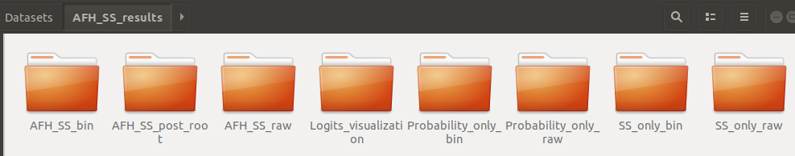

5). Open the [C++ project](./evaluate_AFH_SS/AFH_SS) and modifiy the paths in main.cpp according to your own settings. The first two paths must be set correctly!

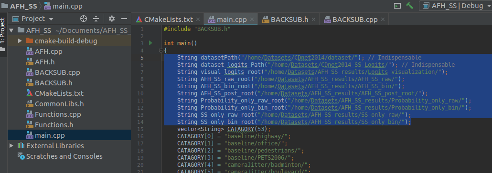

6). (no need to change) Write the learned parameters in step 1.2 in BACKSUB.h. Since we have trained the top mode and set the parameters in advance, there is no need to change them. The first column are for other use and PLEASE DO NOT CHANGE THEM! If one want to use other parameters, just copy the trained parameters to the SECOND~LAST COLUMNS!

7). Set the path for opencv in CMakeLists.txt.

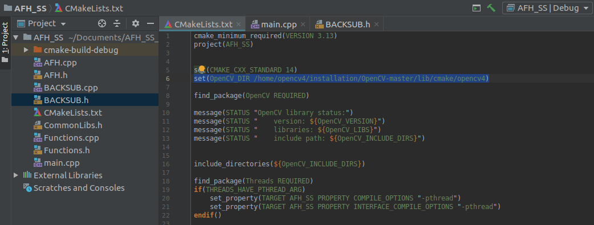

Run the project and you will see all intermediate results. These results are also recorded in the corresponding folders.

We also provide a program to calculate the scores in a [jupyter notebook](./evaluate_AFH_SS/scores.ipynb). All score records are also given there.

### 3.2. Evaluate SWCD+SSA

This is our best scored model, which built upon the [SWCD method](https://www.spiedigitallibrary.org/journals/Journal-of-Electronic-Imaging/volume-27/issue-2/023002/SWCD--a-sliding-window-and-self-regulated-learning-based/10.1117/1.JEI.27.2.023002.short?SSO=1) and the [fine-tuned DeepLab V3+](./Models/frozen_inference_graph.pd). Before running our code, MAKE SURE the following preparations are done:

1). The entire [CDnet2014 datset](http://jacarini.dinf.usherbrooke.ca/dataset2014) are downloaded and extracted;

2). All semantic logits are calculated for the CDnet2014 dataset (see section 2.2);

3). Download the [results](http://jacarini.dinf.usherbrooke.ca/m/SWCD_526.zip) of SWCD from CDnet website and extract them;

4). One gets all the trained parameters of the top model. (Since we have already recorded these parameters, you do not need to train the top model again.)

5). (optional) Setup folders to record all kinds of intermediate results. To do this, just copy, replicate, and rename the empty results folder under the root path of the downloaded CDnet2014 dataset.

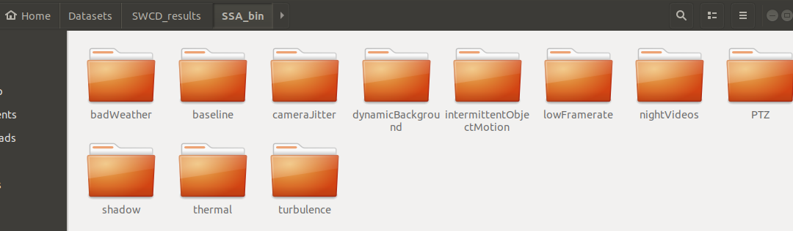

6). Open the [C++ project](./evaluate_SWCD_SS/AFH_SS) and modifiy the paths in main.cpp according to your own settings. The first two paths must be set correctly!

7). (no need to change) Write the learned parameters in step 1.2 in BACKSUB.h. Since we have trained the top mode and set the parameters in advance, there is no need to change them. The first column are for other use and PLEASE DO NOT CHANGE THEM! If one want to use other parameters, just copy the trained parameters to the SECOND~LAST COLUMNS!

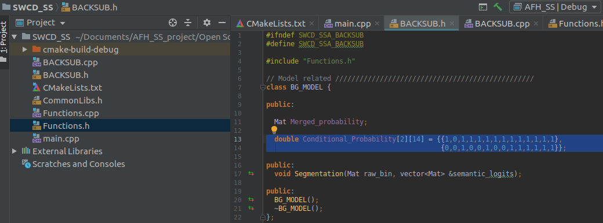

8). Set the path for opencv in CMakeLists.txt.

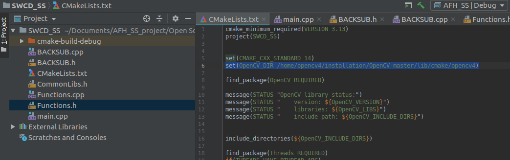

Run the project and you will see binary results. These results are also recorded in the corresponding folders. We also provide a program to calculate the scores in a [jupyter notebook](./evaluate_SWCD_SS/scores.ipynb). All score records as well as per category scores are also given there.

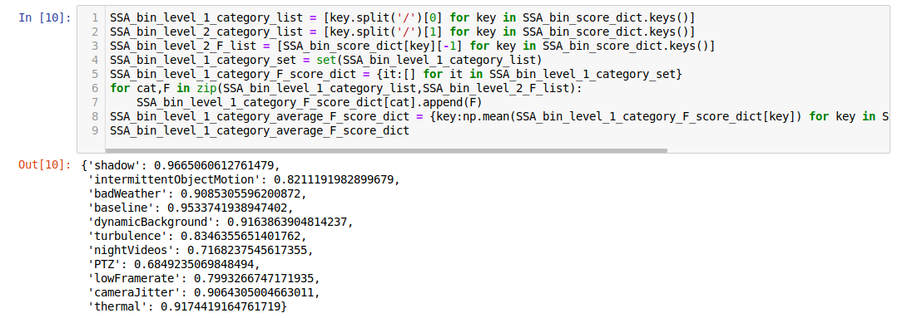
